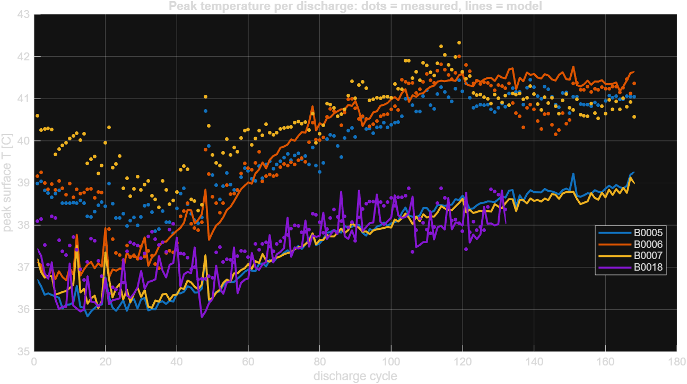

# Walls as a Battery: Autonomous Power Allocation for a Mars Habitat

**MATLAB in Space Hackathon, Track 2: Energy, Power Grid & Closed-Loop Life Support**
Team: Ajay & Kartik

A Mars habitat is too far from Earth for mission control to react in time when a dust storm hits. We built an autonomous controller that keeps life support running through dust storms, an aging battery, and sudden battery failures, with no human input. Its key idea: **the habitat's cabin and walls store heat, so the controller can use them as a second battery.** It pre-heats the cabin with surplus midday solar and lets it coast through the night, saving electrical energy for life support.

**Headline results (200 randomized missions, frozen settings):** compared with a rule-based priority-shedding controller, our controller was **safer in 117 missions and never less safe**. Average life-support outage fell from **17.8 h to 2.8 h**, and the worst-case outage from **136 h to 18 h**.


---

## Problem

The habitat runs on solar panels and a battery bank. Loads fall into priority tiers:

| Tier | Load | Power | Rule |
|---|---|---|---|
| Critical | Life support (CO₂ scrubbing, O₂, water) | 3.0 kW | Never shed |
| Essential | Comms, avionics | 1.5 kW | Shed only if needed |
| Heating | Cabin heaters | 0 to 10 kW | Keep cabin 18 to 26 °C |
| Deferrable | Science, ISRU, rover charging | 4.0 kW (08:00 to 18:00) | Shed first |

Three things go wrong during a mission: a dust storm cuts solar output, the battery loses capacity as it ages, and a battery string fails suddenly. The controller must decide every hour what to power, with no human in the loop.

## Approach

### 1. Heat equation thermal model (`habitat/thermal.py`)
Heat flows from the cabin through a 10 cm insulated wall into Mars air at roughly −95 to −25 °C. Inside the wall, temperature obeys the **1D heat equation**:

```math
\frac{\partial T}{\partial t} = \alpha \frac{\partial^2 T}{\partial x^2}, \qquad 0 \le x \le L, \qquad \alpha = \frac{k}{\rho c}
```

with convective boundaries on both faces and a lumped cabin node of heat capacity $C$:

```math
C \frac{dT_c}{dt} = h_{in} A \big(T(0,t) - T_c\big) + Q(t), \qquad -k \frac{\partial T}{\partial x}\Big|_{x=L} = h_{out}\big(T(L,t) - T_{amb}(t)\big)
```

where $Q$ is heater power plus waste heat from running equipment. We discretize the wall with finite differences (10 nodes) and integrate with backward Euler, which is unconditionally stable at $\Delta t = 1$ h. Stacking the cabin and wall temperatures into a state vector $\mathbf{x}$ gives a linear state-space model:

```math
\mathbf{x}_{k+1} = A_d \, \mathbf{x}_k + B_q \, Q_k + B_a \, T_{amb,k}, \qquad A_d = (\mathbf{C} - \Delta t \, \mathbf{K})^{-1}\mathbf{C}
```

where $\mathbf{C}$ holds the node heat capacities and $\mathbf{K}$ the conductances. Because it is linear in $Q$, it fits directly inside the optimizer.

**Why 1D:** the wall is about 10 cm thick and the habitat is meters across, so heat flows almost entirely through the wall's thickness (the thin-wall approximation). A 3D model would need an invented geometry, add no accuracy given uncertain parameters, and be too slow to re-solve every hour.

### 2. Fourier solar forecast and storm detection (`habitat/forecast.py`)
Solar generation is simulated from physics, not from a Fourier series, so the forecast is not circular:

```math
P(t) = S_\text{Mars} \, \max\big(\cos\theta_z(t), 0\big) \, e^{-0.3\,\tau(t)} \, A_\text{array} \, \eta \, \varepsilon(t)
```

where $S_\text{Mars} = 590$ W/m², $\theta_z$ is the solar zenith angle, $\tau$ is dust optical depth, and $\varepsilon$ is multiplicative noise. The factor 0.3 reflects that Mars dust scatters light rather than fully blocking it.

The forecaster fits harmonics of the Mars-day period $P_\text{sol} = 24.66$ h to **past measured generation only** (least squares over the last 2 to 3 sols), then extrapolates 36 hours ahead:

```math
\hat{P}(t) = \max\!\Big(0,\; a_0 + \sum_{n=1}^{6} \Big[a_n \cos\frac{2\pi n t}{P_\text{sol}} + b_n \sin\frac{2\pi n t}{P_\text{sol}}\Big]\Big)
```

It never sees the true storm schedule. A storm detector compares each sol's actual energy $E$ to its forecast $\hat{E}$ and raises an alert when

```math
r = \ln\frac{E}{\hat{E}} < \operatorname{median}(r_\text{past}) - \max\big(4 \cdot \operatorname{MAD}(r_\text{past}),\; 0.05\big)
```

where $r_\text{past}$ are the ratios from earlier nominal sols and MAD is the median absolute deviation, scaled by 1.4826 to match a standard deviation. The threshold is **learned from the forecaster's own past errors**, so there is no hand-set cutoff.

### 3. Thermal-aware model predictive control (`habitat/mpc.py`)
Every hour, the controller solves a linear program over the next $H = 36$ hours. Decision variables for each hour $h$ are heater power $u_h$, essential and deferrable load fractions $e_h, d_h \in [0,1]$, battery charge and discharge $c_h, g_h \ge 0$, and slack variables $s$ that keep the problem feasible when energy runs out:

```math
\begin{aligned}
\min \quad & \sum_{h=0}^{H-1} \Big( 10^4 s^\text{crit}_h + 500\, s^\text{cold}_h + 20\, s^\text{res}_h + 0.3\, s^\text{comf}_h - 5\, P_e e_h - P_d d_h + 0.01\,(u_h + q^\text{rad}_h) \Big)\Delta t \;-\; 0.8\, E_H \\
\text{s.t.} \quad & \hat{P}_h \Delta t + g_h = \big(P_\text{crit} - s^\text{crit}_h + P_e e_h + P_d d_h + u_h\big)\Delta t + c_h + \text{curtail}_h && \text{power balance} \\
& E_{h+1} = E_h + \eta_c c_h - g_h/\eta_d, \quad 0 \le E_h \le E_\text{cap} && \text{battery} \\
& \mathbf{x}_{h+1} = A_d \mathbf{x}_h + B_q Q_h + B_a T_{amb,h} && \text{heat equation} \\
& T_\text{min} + 0.5 - s^\text{cold}_h \le T_{c,h+1} \le T_\text{max} && \text{safe band} \\
& E_{h+1} \ge 0.15\, E_\text{cap} - s^\text{res}_h && \text{reserve} \\
& T_{c,h+1} \ge T_\text{set} - s^\text{comf}_h && \text{comfort}
\end{aligned}
```

$\hat{P}_h$ is the Fourier forecast, $Q_h = u_h + \gamma\,(\text{running loads}) - q^\text{rad}_h$ is heater power plus waste heat ($\gamma = 0.6$) minus heat dumped by the radiators, $E_H$ is stored energy at the end of the horizon, and $P_e = 1.5$ kW, $P_d = 4$ kW. It applies only the first hour's decision, then re-plans (receding horizon). The penalty weights encode priorities: losing life support costs far more than a cold cabin, which costs more than losing comms, which costs more than skipping science. The constraint matrices depend only on fixed parameters, so they are built once and only the right-hand sides change each hour.

**Pre-heating emerges on its own.** Nobody programmed it: during storms the optimizer heats the cabin to about 23.5 °C at midday, then coasts down to the 18.5 °C floor overnight, because storing midday energy as heat avoids battery losses and the capacity lost in the string failure.

### 4. Baselines (`habitat/controllers.py`)
- **Naive:** runs everything, holds 21 °C.
- **Rule-based (the real baseline):** sheds science below 50% battery, lowers the heat setpoint below 30%, cuts essential systems below 15%.

## Data: real vs simulated

| Input | Source | Real? |
|---|---|---|
| Battery capacity fade | NASA Li-ion Battery Aging data (B0005, B0006, B0018), 1 cycle = 1 sol | **Real** |
| Battery end of life | 1.4 Ah (30% fade), per dataset | **Real** |
| Dust opacity range | Opportunity measured tau ≈ 0.5 normally and a record 10.8 on June 10, 2018 | **Real values**, stylized storm shape |
| Solar irradiance | Mean solar constant at Mars, 590 W/m² | **Real constant** |
| Battery cell temperature, voltage, current, impedance | NASA Li-ion Battery Aging data (B0005 to B0018), used to validate the heat-equation method | **Real** |
| Thermal, load, array parameters | Assumptions in `habitat/config.py` | Simulated (see sensitivity analysis) |

No public dataset of real habitat life-support telemetry exists, so the habitat itself is simulated, with all assumptions in one file.

## How to run

```bash
pip install -r requirements.txt
# put the NASA battery .mat files anywhere under ./data
python run_scenario.py                     # one storm scenario, 3 controllers, timeline plot (~10 s)
python run_monte_carlo.py --n 200          # 200 randomized missions (~4 min on 8 cores)
python run_analysis.py all                 # severity, detector, sensitivity analyses
python validate_thermal.py                 # thermal model verification
# in MATLAB (needs Python + NumPy, check with pyenv):
#   validate_battery_thermal                   heat equation vs real NASA cell temperatures
#   testCase = 'verify'; heat_equation_1d      solver convergence check
```

All outputs go to `results/`.

## Results

### Single scenario: storm (tau 3.5) + 25% battery string failure on sol 14

| Controller | Life-support outage | Hours below 18 °C | Lowest cabin temp | Science done | Essential uptime |
|---|---|---|---|---|---|
| Naive | 46 h | 64 h | 12.4 °C | 98% | 95% |
| Rule-based | 4 h | 83 h | 14.7 °C | 82% | 94% |
| **MPC (ours)** | **0 h** | **0 h** | **18.5 °C** | **84%** | 85% |

The MPC is the only controller that keeps life support powered and the cabin safe for the whole mission, and it still completes more science than rule-based. The tradeoff is essential-system uptime: during the storm it deliberately turns off comms to protect life support and cabin temperature.

### 200 randomized missions, frozen settings

Each mission randomizes storm timing, peak severity (tau 2.0 to 4.5), duration, battery failure time and size (or none), which NASA cell, and starting battery age. No controller is retuned between missions.

| Controller | Zero-outage missions | Avg outage | Zero-cold missions | Avg cold hours | Science | Essential uptime |
|---|---|---|---|---|---|---|
| Naive | 50% | 39.4 h | 50% | 61.9 h | 97% | 96% |
| Rule-based | 65% | 17.8 h | 42% | 79.0 h | 86% | 94% |
| **MPC** | **68%** | **2.8 h** | **66%** | **47.5 h** | **89%** | 90% |

**Paired comparison on the same missions:** MPC safer in 117, tied in 83, **less safe in 0**.


### By storm severity

| Storm | Missions | Naive | Rule-based | MPC |
|---|---|---|---|---|
| Mild (tau < 3) | 85 | 100% / 0 h | 100% / 0 h | 100% / 0 h |
| Moderate (3 to 3.75) | 63 | 24% / 110 h | 70% / 33 h | **79% / 8 h** |
| Severe (> 3.75) | 52 | 0% / 179 h | 2% / 136 h | **4% / 18 h** |

*Zero-outage rate / worst-case life-support outage.*

In mild storms, every controller survives. In severe storms, no solar-only habitat collects enough energy to avoid some outage. The difference is how badly things go: **the MPC turns multi-day blackouts into outages of hours.** When energy truly runs out, it keeps life support powered and lets the cabin get cold, by design, since losing CO₂ scrubbing is worse than being cold.

### Autonomous storm detection (200 missions)

- Storms detected: **96%**, median **1.4 sols** after onset (90th percentile 2.2)
- False alarms: **4 on 921 clear sols (0.4%)**
- Fourier day-ahead forecast error on clear sols: **1.6%** of daily energy

The MPC adapts through the forecast itself; the storm flag serves as an alert to the crew.

### Robustness to modeling assumptions (30 missions per setting, no retuning)

| Setting | MPC better | MPC worse | Rule-based avg outage | MPC avg outage |
|---|---|---|---|---|
| Baseline | 20 | 0 | 19.5 h | 2.9 h |
| Thin wall (7 cm) | 30 | 0 | 61.1 h | 9.3 h |
| Thick wall (15 cm) | 6 | 0 | 0.4 h | 0.0 h |
| Half cabin heat capacity | 21 | 0 | 18.9 h | 2.9 h |
| Double cabin heat capacity | 18 | 0 | 18.5 h | 2.6 h |
| Small battery (200 kWh) | 26 | 0 | 27.7 h | 4.1 h |
| Big battery (400 kWh) | 17 | 0 | 13.6 h | 2.3 h |
| Worse insulation (k = 0.045) | 30 | 0 | 68.0 h | 10.4 h |

Across **240 missions and 8 parameter variations, the MPC was never less safe**, and it cut average outage 5 to 7 times in every setting where outages occurred. The harder the habitat, the more the controller matters.

### Thermal model verification

We checked the controller's thermal model against an **independent Crank-Nicolson heat-equation solver** written by Ajay (`heat1d.py`, second-order in time, validated against the exact sine-decay solution).

- **Wall:** after a sudden outside cold snap, the controller's model (1 h steps, 10 nodes) misses the wall's first-hour transient by up to 4.2 °C, then matches the fine solver (5 s steps, 201 nodes) to within 0.01 °C from hour 6. The steady heat flux matches exactly (34.8 W/m²).
- **Cabin:** with heaters off for 48 h, cabin temperature error versus a 36 s reference is at most **0.06 °C**.

The wall's transient lasts about $L^2/\alpha \approx 3$ hours, while the cabin responds over days ($C/UA \approx 120$ h), so 1-hour steps are accurate for the quantity every control decision depends on.


### Heat-equation validation on real NASA battery data (MATLAB)

Our habitat thermal model is simulated, so we also tested the same modeling approach, the heat equation, against **real measurements**. Ajay modeled heat conduction inside each NASA 18650 cell during discharge:

- **Model:** radial heat equation in a cylinder of radius $R$, with symmetry at the axis and convective (Robin) cooling at the surface:

```math
\frac{\partial T}{\partial t} = \alpha \, \frac{1}{r}\frac{\partial}{\partial r}\Big(r \frac{\partial T}{\partial r}\Big) + \frac{\beta\, q(t)}{\rho c \, V_\text{cell}}, \qquad \frac{\partial T}{\partial r}\Big|_{r=0} = 0, \qquad -k \frac{\partial T}{\partial r}\Big|_{r=R} = h_\text{eff}\big(T(R,t) - T_{amb}\big)
```
 It is solved by `heat1d.py` (NumPy), called from MATLAB through its Python interface (`py.*`) in `validate_battery_thermal.m`. The solver supports explicit, backward Euler, and Crank-Nicolson time stepping with Dirichlet, Neumann, or convective (Robin) boundaries; `heat_equation_1d.m` drives it from MATLAB, and its `verify` mode confirms second-order convergence against the exact solution.
- **Heat source, two versions:** *voltage-based*, the irreversible heat $q = |I|\,(U_\text{ocv} - V)$ from measured current and voltage, with open-circuit voltage estimated from each preceding charge curve; and *impedance-based*, $q = I^2 (R_e + R_{ct})$ from the most recent impedance (EIS) test.
- **Fitting:** only two parameters, the surface heat-transfer coefficient $h_\text{eff}$ and a heat scale factor $\beta$ ($\beta \approx 1$ means the energy balance closes), fitted on every discharge of B0005, B0006, and B0007.
- **Blind validation:** every discharge of **B0018** predicted with **no refitting**, compared with its surface thermocouple.

| Heat model | Battery | Role | RMSE | Max error | Mean peak-temp error | Within 1 °C |
|---|---|---|---|---|---|---|
| Voltage-based | B0005 to B0007 | train | 0.96 to 1.28 °C | 3.7 to 5.1 °C | 0.53 to 2.28 °C | 51 to 69% |
| **Voltage-based** | **B0018** | **blind test** | **1.00 °C** | **3.0 °C** | **0.58 °C** | **61%** |
| Impedance-based | B0005 to B0007 | train | 1.14 to 1.55 °C | 4.1 to 5.9 °C | 1.03 to 3.94 °C | 52 to 67% |
| Impedance-based | B0018 | blind test | 2.18 °C | 4.8 °C | 1.12 °C | 32% |

**Takeaway:** the voltage-based model predicts a battery it never saw to within about 1 °C RMSE, and its blind-test error is no worse than its training error, so it generalizes. The impedance-based model generalizes worse, likely because impedance tests are infrequent and miss changes between them. This supports using heat-equation models for habitat control decisions. It validates the *method* on real data; the habitat's own geometry and parameters remain assumptions.

Figures: `results/voltage/` and `results/eis/` (parity plots, error per cycle, peak temperature over battery life, example cycles).



## Limitations and next steps

- **Simulated habitat:** thermal, load, and array parameters are assumptions. The sensitivity analysis shows the conclusions hold across plausible ranges, but real habitat data would be the true test.
- **Lab battery data:** the NASA cells were cycled at controlled temperatures, not Mars cold. Mapping one lab cycle to one sol is a modeling choice.
- **Stylized storms:** storm shapes are ramps and decays using real tau values, not real tau time series.
- **Passive heat rejection:** we assume radiator louvers dump excess heat above 26 °C at no power cost.
- **Severe storms:** at 2018's record tau of 10.8, a solar-only habitat cannot survive with any controller. Real habitats would need backup power, such as a small fission unit; finding the smallest backup each controller needs is a natural next step.
- **Next:** feed a real telemetry anomaly detector (e.g., on NASA SMAP data) into the failure flags, use a mixed-integer program for on/off loads, and add chance constraints on battery uncertainty.

## Repository layout

```
habitat/
  config.py       all parameters, real values marked [REAL]
  solar.py        Mars solar + dust attenuation
  thermal.py      1D heat equation + cabin, linear state-space
  battery.py      pack driven by NASA capacity fade + string failure
  forecast.py     Fourier forecast + self-calibrating storm detector
  controllers.py  naive and rule-based baselines
  mpc.py          thermal-aware MPC (linear program, HiGHS)
  simulator.py    closed-loop simulation, metrics, plots
heat1d.py           independent heat-equation solver (Crank-Nicolson), used by both verifications
heat_equation_1d.m  MATLAB wrapper for heat1d.py
validate_battery_thermal.m  heat-equation validation on real NASA battery temperatures
run_scenario.py     single scenario
run_monte_carlo.py  randomized missions
run_analysis.py     severity, detector, sensitivity
validate_thermal.py thermal model verification
results/            all plots and CSVs
```

## Dataset credits

- **NASA Li-ion Battery Aging Data Set:** B. Saha and K. Goebel, NASA Ames Prognostics Center of Excellence (PCoE), NASA Ames Research Center.
- **2018 dust storm opacity:** NASA/JPL, "Opportunity Hunkers Down During Dust Storm" (June 2018), and JPL Photojournal PIA22930, "Last Images Opportunity Took."
